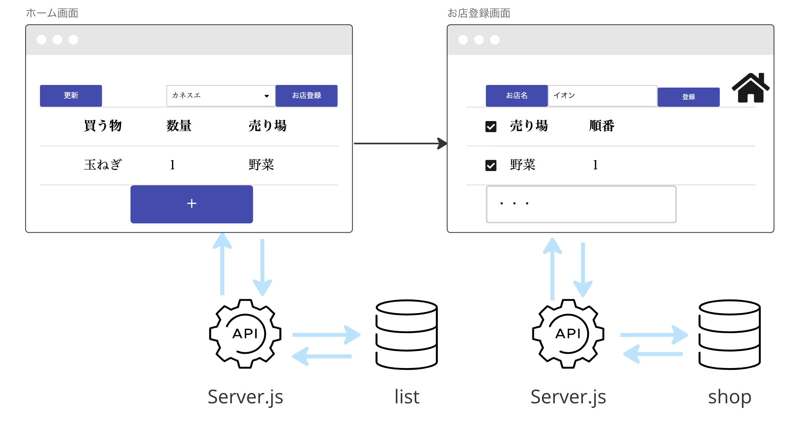
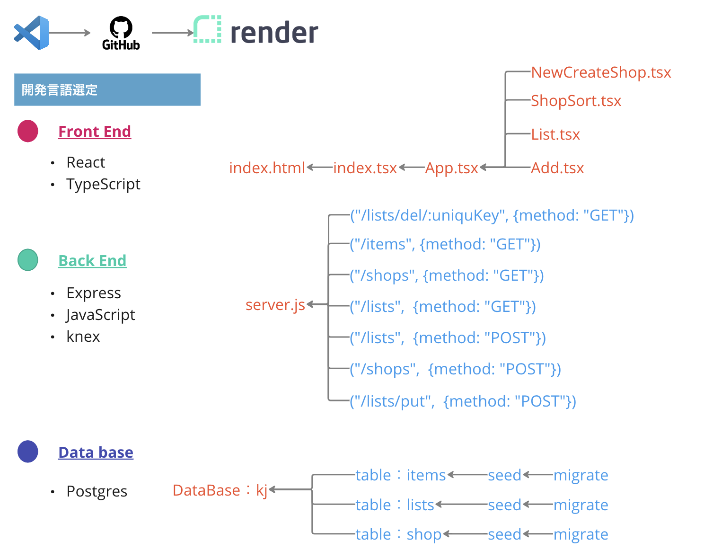
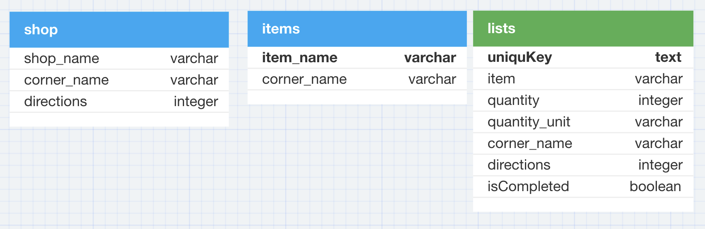

### 【買物時短君】

### 【Git 情報】


---

### 【使用システム】

<div>


</div>

<hr>

## システム概要

このシステムは買物時間の短縮をサポートします。

### 背景

- 【困りごと】買物に時間がかかる
-           理由 → スーパの売り場の配置が分かっていないため売り場間の行き来が多い
- 【欲しいシステム】 一筆書きのように買物するために買い物リストを売り場順に並び替えてほしい

### 使用 URL（デプロイ先）

- 実際のシステム[「買物時短君」](https://kjk.onrender.com/)はこちらになります。

## 機能

- 買うものを登録
- 買ったものを削除、チェック
- お店毎に買い物リストをソート
- お店の登録

## アーキテクチャー



## プログラム構成



## データベーススキーマ



## 使用環境

- macOS
- node.js
- PostgreSQL

## 使い方(ローカル)

1. ライブラリを `npm i` でインストールしてください。
2. psql
3. CREATE DATABASE kj
4. npm run migrate
5. npm run seed
6. npm run server
7. npm start

## インストール

```
$ git clone https://github.com/〜〜
$ cd 〜〜
```

## テスト

server.js のテストを mocha&chai で実施

## 作者

菊地

## 今後の計画

- css でスタイルを整える
- お店の配置を図で見える化
